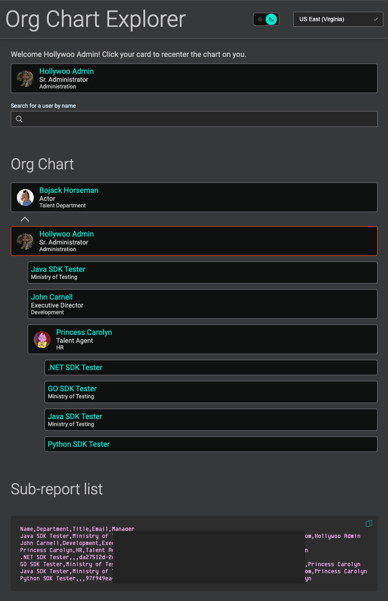

The [Genesys Cloud Users API resources](/useragentman/users/) provide access to User configuration data. In this blueprint, we'll be focusing on the relationships between users as defined by a user's `manager`. The Genesys Cloud API will be used to retrieve the relationships between users as well as resolving user details for displaying in the app, such as the user's name, department, and profile picture. The app also demonstrates processing large queues of API requests and handling API rate limiting using a reactive approach.

:::info
Try this blueprint live in your browser with your org's data, no setup required! Hosted using Github Pages: [https://genesyscloudblueprints.github.io/org-chart-explorer/](https://genesyscloudblueprints.github.io/org-chart-explorer/).
:::



## Application Overview

The web application is a client side app built using [TypeScript](https://www.typescriptlang.org/) and [React](https://reactjs.org/). The source code for the app is open source and can be found on GitHub in [org-chart-explorer/app](https://github.com/GenesysCloudBlueprints/org-chart-explorer/tree/main/app).

### Dependencies

Before digging into the application itself, here are some notable packages used by the app and what they do:

* [Genesys React Components](https://purecloudlabs.github.io/genesys-react-components/) - a set of open source React components built by Genesys, primarialy used by the Developer Center's frontend app
* [Genesys Dev Icon Pack](https://purecloudlabs.github.io/genesys-dev-icon-pack/) - an open source web icon pack built by Genesys, similar in spirit to something like Font Awesome but with icons purpose-built for the Developer Center's frontend app.
* [React Router](https://reactrouter.com/) - a library for React to manage URL-based routing within a single page app
* [Recoil](https://recoiljs.org/) - a state management library for React, but less opinionated than Redux and offers a shim to interact with state objects outside of components via [recoil-nexus](https://www.npmjs.com/package/recoil-nexus)
* [axios](https://axios-http.com/docs/intro) - a HTTP client

### Genesys Cloud API, JS SDK, and React 18

This blueprint interacts with the Genesys Cloud API directly without the usage of the [JavaScript Platform Client SDK](/devapps/sdk/docexplorer/purecloudjavascript/). This was primarialy an architectural decision due to a new behavior in React 18 relating to dependency processing with webpack. The short description is that the SDK unfortunatley requires some node.js polyfills and React's webpack config doesn't handle this automatically anymore and now requires ejecting to edit the webpack config. For prior versions of React, usage was fairly straightforward, as demonstrated in the blueprint [Develop a React app with Typescript that uses the Genesys Cloud Platform SDK](/blueprints/react-app-with-genesys-cloud-sdk/). Future iterations of the JS SDK intend to remedy this situation with a more web-friendly package.

The API types in `app/src/helpers/GenesysCloudAPITypes.ts` were copied from the JavaScript SDK's `index.d.ts` file to make use of the SDK's model types even though the SDK itself wasn't used.

## App Authorization

The first thing the app must do is become authorized. This is accomplished by allowing the user to choose their region using a dropdown in the header, then prompting the user to initiate the auth flow if the app does not have a valid auth token. See `app/src/App.tsx` for the implementation in the UI.

The app uses Genesys Cloud OAuth authorization ([implicit grant](/authorization/platform-auth/use-implicit-grant)) to authorize the app to make API requests. When the user clicks the link to begin the flow, the following function is executed to navigate the user to the Genesys Cloud auth server to be challenged for their credentials.  

```typescript
export function InitiateAuthFlow(region: string) {
	const oauthURL =
		`https://login.${region}/oauth/authorize` +
		`?client_id=${encodeURIComponent(process.env.REACT_APP_GENESYS_CLOUD_CLIENT_ID || '')}` +
		`&response_type=token` +
		`&redirect_uri=${encodeURIComponent(process.env.REACT_APP_GENESYS_CLOUD_REDIRECT_URI || '')}`;

	console.log('Initiating OAuth flow to', oauthURL);
	window.location.href = oauthURL;
}
```

The user is redirected away from the app to complete authentication and is then redirected back to the app with an access token in the URI's fragment (also known as a the "hash"). The [`GenesysCloudAPI`](https://github.com/GenesysCloudBlueprints/org-chart-explorer/blob/main/app/src/helpers/GenesysCloudAPI.ts) class is loaded during the initial app load and its constructor checks the fragment for an access token. If it finds one, the access token is set to a variable on the class instance and the fragment is cleared to review the token from view of the user. 

When the authorization check is performed, it will use the token obtained in the constructor to make a request to [GET /api/v2/users/me](/devapps/api-explorer#get-api-v2-users-me). If that request is successful, the app's initialization will continue in the context of the user returned from that request. This user information is stored in the user data atom (global state object), accessible via the `useUserData()` hook. If the request fails, this result will trigger the `useAuthFailed()` hook and the user will be presented with a prompt to log in.

## Loading and Displaying Data

When valid authorization is confirmed, the `App` component will display the `OrgChartApp` instead of the prompt to log in. The app initially focuses on the authenticated user and begins loading their superiors and direct reports.

The `OrgChart` component is the initiator of the data loading. When the target user is set, an effect is triggered that uses the API to fetch the user's superiors and loads the target user as the initial user for an `OrgChartMember` component. The superiors are mapped as a vertical tree above the target user.

The `OrgChartMember` component is responsible for orchestrating the display of a user's information in the org chart. The user in context is displayed in a `UserCard` component. The component also uses the API to load the direct reports of a user asychronously. When the direct reports are loaded, they are displayed under the user in a recursive usage of the `OrgChartMember` component. 

### The `GenesysCloudAPI` Class

In lieu of the SDK's out-of-the-box methods, a purpose-built class was created to encapsulate the Genesys Cloud API usage that separates data loading concerns from presentation and business logic contained in the React components. This class also provides Recoil atoms that it updates as appropriate to trigger React state events within the app as a result of asynchronous API operations. The class can be found in the project at `app/src/helpers/GenesysCloudAPI.ts`.

### Getting Superiors

The API class provides an async method `GetSuperiors(userId: string)` that loads the list of superiors from the API using `GET /api/v2/users/{userId}/superiors`. This returns an array of users representing the full superiors chain above the user, with their direct supervisor (e.g. team lead) first in the list and most superior supervisor (e.g. CEO) last. Give it a try with your user using the API Explorer resource right here! 👇

<dxui:OpenAPIExplorer verb="get" path="/api/v2/users/{userId}/superiors" />

This resource is implemented in `GenesysCloudAPI` using the rate limit retrier as follows:

```typescript
public async GetSuperiors(userId: string) {
	if (!userId) return undefined;

	const res = await this.rateLimitRetryer(() => this.api.get(`/api/v2/users/${encodeURIComponent(userId)}/superiors`));
	if (isSuccess(res) && res.data) {
		const users = res.data as User[];
		users.forEach(this.addCachedUser.bind(this));
		return users;
	} else {
		return undefined;
	}
}
```

### Getting Direct Reports

A user's direct reports are fetched from the API using `GET /api/v2/users/{userId}/directreports`. Unlike the superiors resource, this only returns a single level of user data. Because of this, the `OrgChartMember` loads itself recursively for each user so each instance can load the direct reports for each user recursively. This allows the app to shake out the full org chart as each user's subordinates are discovered.

Try getting your direct reports using the API Explorer resource right here! 👇

<dxui:OpenAPIExplorer verb="get" path="/api/v2/users/{userId}/directreports" />

This resource is implemented in `GenesysCloudAPI` using the rate limit retrier as follows:

```typescript
public async GetDirectReports(userId: string) {
	if (!userId) return undefined;

	const res = await this.rateLimitRetryer(() => this.api.get(`/api/v2/users/${encodeURIComponent(userId)}/directreports`));
	if (isSuccess(res) && res.data) {
		const users = res.data as User[];
		users.forEach(this.addCachedUser.bind(this));
		addSubReports(users);
		return users;
	} else {
		return undefined;
	}
}
```

:::info
It should be noted that this approach to lazy-loading the direct reports across the tree using components is a design pattern that's common in React, but may not be suited to all use cases or UI frameworks. Components are meant to be self-contained in that they are given the key properties they need when initialized and then the component is expected to know how to satisfy all of its needs to be able to render itself. This yields an experience where the UI loads partially and continues updating as more data becomes available. An equally valid approach would be to build the full reporting structure and show a loading placeholder until the tree is fully resolved. This approach would be especially useful for use cases where the org chart is processed as a whole to extract information about relationships across its structure.
:::

### Displaying Direct Reports as CSV Data

The `OrgChart` component  has an additional feature to display the list of direct reports as CSV data. It makes use of the `useSubReports()` hook to get a list of all loaded subreports, then uses the data to prepare a CSV file including each direct report's name, department, title, email address, and manager's name. This data comes from `subReportsAtom` in `GenesysCloudAPI`. This atom is updated by the API class when results are retrieved using the `GetDirectReports` function. 

### Rate Limit Retryer

The API class contains a function `rateLimitRetryer(requestFunc: {(): Promise<AxiosResponse<any, any>>}): Promise<AxiosResponse<any, any>>`. This function accepts a function that when executed will make a request to the API and return an axios response object. This wrapper process will add the function to a queue of requests, then a pool of processors will execute the function and check the response codes for rate limiting. When rate limited responses are encountered (HTTP 429 status code), the processor will sleep for the prescribed amount of time and then retry the request.

This process allows the lazy-loading UI to be unconcerned with the rate limiting status of the API and request any data it needs whenever it needs it. The API class will queue up the requests and process them in a FIFO manner until the queue is empty. The UI will be asynchronously waiting on the response until a queue processor eventually fulfils the request and allows the UI component to proceed to update itself.

The implementation of the retryer is as follows. It is hardcoded to retry each request a maximum of 5 times before giving up and returning the last response it got. In practice, this should only ever retry once because it won't be rate limited anymore after sleeping the correct amount of time.

```typescript
private async rateLimitRetryerImpl(requestFunc: { (): Promise<AxiosResponse<any, any>> }) {
	let retries = 5;

	// Invoke request function first (this ensures we can always return a response and never undefined)
	let res = await requestFunc();

	// Loop while checking for rate limits
	while (retries > 0) {
		retries--;

		this.setIsRateLimited(res.status === 429);

		// Return response unless it's been rate limited
		if (res.status !== 429 || retries <= 0) return res;

		// Determine how long to wait
		// https://developer.genesys.cloud/platform/api/rate-limits
		this.retryAfter = parseInt(res.headers['retry-after'] || '59');
		// Normalize retry after value and add a second just to be sure
		if (!(this.retryAfter > 0)) this.retryAfter = 60;
		else this.retryAfter++;

		// Wait
		console.warn(`Sleeping ${this.retryAfter}s to retry rate limited response`);
		await timeout(this.retryAfter);

		// Invoke request function
		console.log('Retrying request...');
		res = await requestFunc();
	}

	return res;
}
```

But wait, isn't JavaScript single threaded? Why queue requests and use a pool of workers when you only have one thread? 

Good question! While it is true that JavaScript is single threaded, API requests take some amount of time to execute and JavaScript releases its thread to process other tasks on its callstack. When the API request completes, the browser puts the callback on JavaScript's callstack to be processed when the thread is available again. This always async nature means we can simulate threading by using the processing time in between request and response to additional processing.
